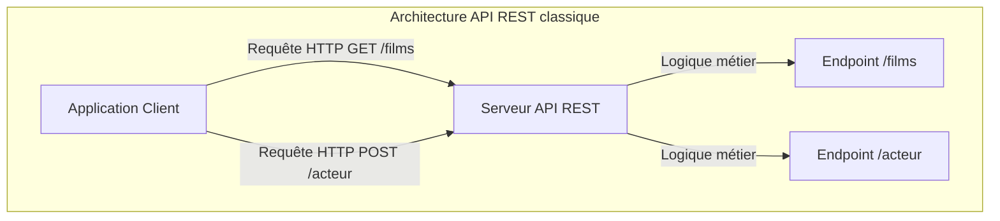
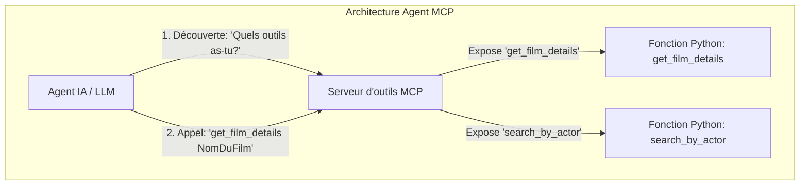
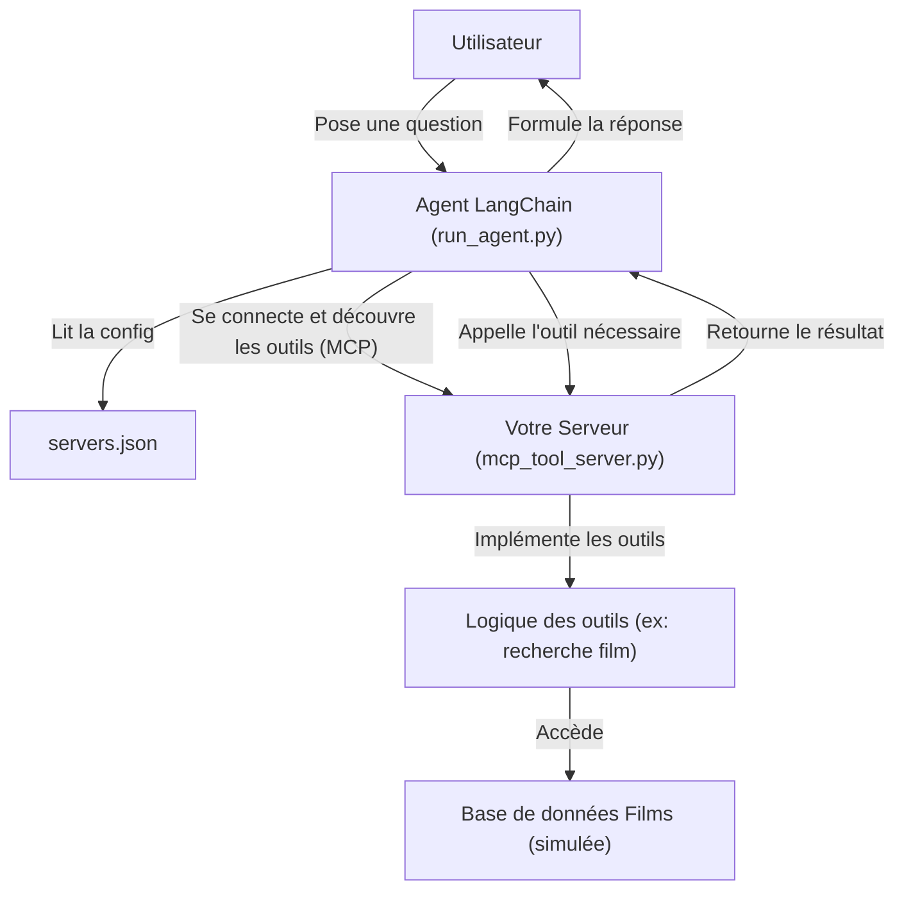

# TP : création d'un serveur d'outils avec MCP pour un Agent IA

## Installation

Ouvrir un terminal dans le dossier racine du projet :

```bash
uv sync # installer les dépendances nécessaires
```

Attention, si derrière un proxy, vous devez ajouter en haut du fichier `run_agent.py` les lignes suivantes :

```python
import os
os.environ["NO_PROXY"] = "127.0.0.1,localhost"
```

## Objectif du TP

L'objectif de ce travail pratique est de développer un petit serveur d'outils en utilisant le protocole **MCP (Model Context Protocol)**.
Ce serveur exposera des fonctionnalités Python spécifiques (nos "outils") que des agents d'intelligence artificielle, comme ceux basés sur de grands modèles de langage (LLM), pourront découvrir et utiliser pour accomplir des tâches.

Dans ce scénario, nous allons créer un serveur qui donne accès à une base de données de films. Un agent LangChain, dont le code vous est entièrement fourni (`run_agent.py`), se connectera à votre serveur pour récupérer des informations sur les films et répondre aux questions d'un utilisateur.

**Votre mission est de compléter le squelette du fichier `mcp_tool_server.py` pour le rendre fonctionnel.**

---

## 1. Contexte : qu'est-ce qu'un serveur MCP ?

Avant de commencer à coder, il est essentiel de comprendre le rôle d'un serveur MCP, qui est au centre de l'IA Agentique. Prenez un moment pour effectuer des recherches sur les questions suivantes :

* **Qu'est-ce que le protocole MCP (Model Context Protocol) ?**
* À quel besoin répond-il dans une architecture basée sur des agents IA ?
  * Quelle est la différence entre exposer une fonction via une API REST classique et via un serveur d'outils ?

Les diagrammes suivants illustrent la différence fondamentale d'approche :





Cette recherche vous aidera à mieux saisir l'importance de chaque ligne de code que vous écrirez.

---

## 2. Fichiers fournis

Vous disposez des fichiers suivants :

1.  **`mcp_tool_server.py` (À COMPLÉTER)** : le squelette du serveur que vous devez développer.
2.  **`run_agent.py` (COMPLET)** : le client qui exécute l'agent LangChain. Vous n'avez pas besoin de le modifier, mais n'hésitez pas à l'étudier pour comprendre comment il découvre et appelle les outils de votre serveur.
3.  Un répertoire `resources` contenant `servers.json`, utilisé par `run_agent.py` pour connaître l'adresse de votre serveur.

Voici comment ces éléments interagissent dans ce TP :



-----

## 3\. Travail à réaliser : Compléter le serveur d'outils

Ouvrez le fichier `mcp_tool_server.py` et suivez les étapes ci-dessous pour le compléter. Les sections à modifier sont indiquées par des commentaires `# TODO`.

## 4. Facultatif : aller plus loin

Une fois que vous avez un serveur fonctionnel, vous pouvez envisager d'ajouter des fonctionnalités supplémentaires :
* Rendre l'agent accessible depuis une API REST (ou au choix GraphQL), permettant à un utilisateur final de la Filmothèque (via un ChatBot par exemple) de poser des questions sur les films via des requêtes HTTP.
* Ajouter des outils supplémentaires, comme la recherche de films par titre, la réservation de billets de cinéma, l'achat du film sur Amazon directement par l'Agent IA, etc. Donnez libre cours à votre imagination !

